# Zero-to-One Skill

> เปลี่ยนไอเดีย 1–2 ประโยค ให้กลายเป็น Working MVP พร้อม deploy ใน 4 ขั้นตอน

---

## Pipeline Overview

```mermaid
flowchart TD
    START([💡 ไอเดีย\n1–2 ประโยค])

    START --> S01

    subgraph S01["⚙️ Step 01 · Discovery & Research"]
        direction LR
        A1["AI Research Analyst\nวิเคราะห์ตลาด · competitors · target users\nผลลัพธ์: 01_discovery_report.md"]
    end

    S01 --> H1

    H1{"👤 Human Checkpoint 1\n\nปัญหาสมเหตุสมผล?\nMarket signal แข็งพอ?\nCompetitor gap ชัดเจน?"}

    H1 -->|"✅ Approve"| S02
    H1 -->|"🔄 ปรับ idea"| START

    subgraph S02["⚙️ Step 02 · Define & Validate"]
        direction LR
        A2["AI Product Manager\nเขียน PRD · User stories · Pricing tiers\nFeature matrix · Business model\nผลลัพธ์: 02_definition_report.md"]
    end

    S02 --> H2

    H2{"👤 Human Checkpoint 2\n\nP0 features ≤ 5?\nPricing tiers สมเหตุสมผล?\nRiskiest assumption ระบุชัด?"}

    H2 -->|"✅ Approve"| S03
    H2 -->|"🔄 ปรับ scope"| S02

    subgraph S03["⚙️ Step 03 · Design & Prototype"]
        direction LR
        A3["AI UX Designer\nออกแบบ screens · flows · design system\nPricing page · Paywall component\nผลลัพธ์: 03_design_brief.md + v0/Bolt prompts"]
    end

    S03 --> H3

    H3{"👤 Human Checkpoint 3\n\nทุก P0 screen มี spec ครบ?\nv0/Bolt prompts พร้อม paste?\nUpgrade flow ชัดเจน?"}

    H3 -->|"✅ Approve"| S04A
    H3 -->|"🔄 ปรับ design"| S03

    subgraph S04A["⚙️ Step 04A · Plan"]
        direction LR
        A4A["AI Engineering Lead\nแตก GitHub Issues · dependency graph\nplan.md · M0–M3 milestones"]
    end

    S04A --> H4

    H4{"👤 Human Checkpoint 4\n\nทุก issue มี acceptance criteria?\nTest cases ≥ 2 ต่อ issue?\nM0 Foundation issues ครบ?"}

    H4 -->|"✅ Approve"| S04B
    H4 -->|"🔄 ปรับ plan"| S04A

    subgraph S04B["⚙️ Step 04B · Build"]
        direction TB
        B1["AI Subagent\nImplement issue ทีละอัน\nbranch: feat/issue-N-slug"]
        B2["QA Agent\nรัน test cases\nGiven · When · Then"]
        B3["Code Review Agent\nตรวจ security · types · spec compliance"]
        B1 -->|"implement"| B2
        B2 -->|"QA_FAILED"| B1
        B2 -->|"QA_PASSED"| B3
        B3 -->|"REQUEST_CHANGES"| B1
    end

    S04B --> MERGE["Merge to main ✅"]
    B3 -->|"APPROVE"| MERGE

    MERGE --> H5

    H5{"👤 Human Checkpoint 5\n\nMVP ทำงานได้ตาม spec?\nReady to ship?"}

    H5 -->|"✅ Ship it!"| DONE(["🚀 MVP Live"])
    H5 -->|"🔄 Fix issues"| S04B

    style START fill:#f0f4ff,stroke:#4f6ef7
    style DONE fill:#f0fff4,stroke:#22c55e
    style H1 fill:#fff7ed,stroke:#f97316
    style H2 fill:#fff7ed,stroke:#f97316
    style H3 fill:#fff7ed,stroke:#f97316
    style H4 fill:#fff7ed,stroke:#f97316
    style H5 fill:#fff7ed,stroke:#f97316
```



---

## Human Checkpoints สรุป

| # | จุด | สิ่งที่ต้องตรวจ | ใช้เวลา |
|---|-----|----------------|---------|
| 1 | หลัง Discovery | Problem จริง? Market signal แข็ง? Competitor gap ชัด? | 30 นาที |
| 2 | หลัง Define | P0 ≤ 5 features? Pricing tiers สมเหตุสมผล? Riskiest assumption ระบุชัด? | 45 นาที |
| 3 | หลัง Design | ทุก P0 screen มี spec? v0/Bolt prompt ใช้ได้? Upgrade flow ครบ? | 1 ชั่วโมง |
| 4 | หลัง Plan | ทุก issue มี test cases ≥ 2? M0 Foundation issues ครบ? ไม่มี circular dep? | 30 นาที |
| 5 | หลัง Build | MVP ทำงานได้ตาม spec? Ready to ship? | ตามขนาด MVP |

---

## URL Structure Convention

> ทุก product ที่สร้างด้วย skill นี้ใช้ pattern นี้เสมอ

```
/              → Landing Page (public)
/pricing       → Pricing page (public)
/login         → Login (public)
/signup        → Sign Up (public)

/app/*         → App — protected routes ทั้งหมด (ต้องการ auth)
/app/dashboard → Dashboard หลัก
/app/[feature] → Feature pages
/app/settings  → Settings
/app/settings/billing → Billing & Plan management
```

---

## ไฟล์ในนี้

| ไฟล์ | บทบาท |
|------|-------|
| `SKILL.md` | Entry point สำหรับ Claude agent |
| `step-01-discovery.md` | System prompt + output schema สำหรับ Step 01 |
| `step-02-define.md` | System prompt + PRD schema + pricing matrix |
| `step-03-design.md` | Design brief schema + screen specs + v0 prompts |
| `step-04-build.md` | Engineering plan + subagent orchestration + QA |

---

## วิธีใช้งาน

### เริ่มต้น (Step 01)

1. เตรียมไอเดีย 1–2 ประโยค เช่น:
   ```
   แอปช่วย SME ไทยสร้าง content โซเชียลมีเดียด้วย AI
   โดยที่เจ้าของร้านไม่ต้องมีความรู้ด้าน marketing
   ```

2. เปิด `step-01-discovery.md` → copy **System Prompt** + **Prompt Template** → วาง idea → รันกับ Claude

3. ตรวจ **Validation Checklist** → approve → ส่ง output ไป Step 02

### ส่งต่อระหว่าง steps

แต่ละ step มี `🔗 HANDOFF` section ที่ด้านบนของ output — กรอกให้ครบก่อนส่งต่อเสมอ

```
Step 01 output → วาง 01_discovery_report.md ทั้งหมดใน Step 02 prompt
Step 02 output → วาง 02_definition_report.md ทั้งหมดใน Step 03 prompt
Step 03 output → วาง 03_design_brief.md ทั้งหมดใน Step 04 Phase A prompt
```

---

## Tech Stack (Fixed)

| Layer | Technology | เหตุผล |
|-------|-----------|--------|
| Framework | Next.js 16+ (App Router) | SSR, file-based routing |
| UI | MUI v6+ | Design system พร้อม, Thai font support |
| Backend / Auth / Storage | Supabase | BaaS ครบ, RLS, realtime |
| LLM API | OpenRouter + SDK | Multi-model, cost control |
| Payment | Stripe | Subscription, Thai baht, webhook |
| Deploy | Vercel | Next.js native, preview per PR |

> ห้ามเปลี่ยน stack เว้นแต่มีเหตุผล document ไว้ใน GitHub Issue

---

## เวลารวมโดยประมาณ

| Phase | เวลา AI | เวลาคุณ (review) |
|-------|---------|-----------------|
| Step 01 Discovery | 2–3 ชม. | 30 นาที |
| Step 02 Define | 2–4 ชม. | 45 นาที |
| Step 03 Design | 3–5 ชม. | 1 ชม. |
| Step 04 Plan | 1–2 ชม. | 30 นาที |
| Step 04 Build | 2–4 สัปดาห์ | ตาม milestone |
